# find (xv6 user program)

## Goal

Implement a simple version of the UNIX `find` program that searches 
a directory tree and prints all files with a specific name.

Example:
```
$ find . b
./b
./a/b
./a/aa/b
```
The program takes two arguments:
- the directory to search in (`.` means current directory)
- the filename to look for (`b`)

It must search recursively through all subdirectories, 
without recursing into `.` and `..`.

## Concepts Practiced

### 1. Recursion

Recursion is a technique to solve problems where a big problem is 
built from smaller subproblems of the same kind.

Example: sum from 1 to 100
```
1
1 + 2
1 + 2 + 3
...
1 + 2 + ... + 100
```
Each step is the same problem but with a smaller size. So instead 
of solving it all at once, we call the same function with a smaller 
input each time.

Every recursion has two parts:

- **recursive case** — call the same function with a smaller problem
- **base case** — the condition where we stop, no more recursive calls

Without the base case, the function calls itself forever until the 
stack overflows and the program crashes.


